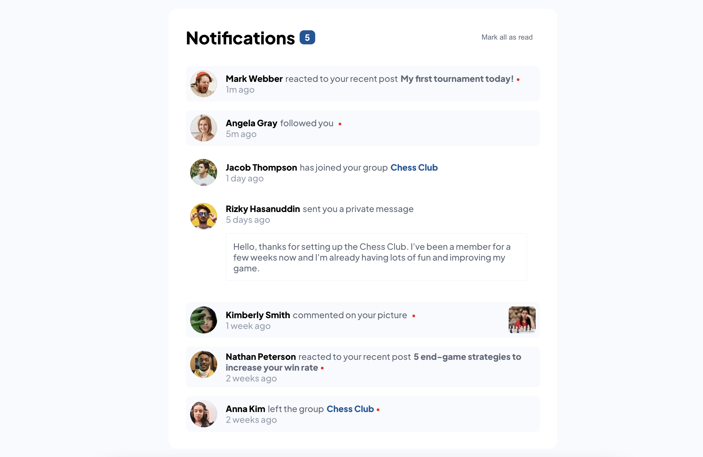

# Notifications page solution from Frontend Mentor

This is a solution to the [Notifications page challenge on Frontend Mentor](https://www.frontendmentor.io/challenges/notifications-page-DqK5QAmKbC). Frontend Mentor challenges help you improve your coding skills by building realistic projects.

### The challenge

Users should be able to:

- Distinguish between "unread" and "read" notifications
- Select "Mark all as read" to toggle the visual state of the unread notifications and set the number of unread messages to zero
- View the optimal layout for the interface depending on their device's screen size
- See hover and focus states for all interactive elements on the page

### Solution Screenshot

### Links

- Solution URL: [https://github.com/katjadanilova/notifications-page-challenge-02](https://github.com/katjadanilova/notifications-page-challenge-02)
- Live Site URL: [https://notifications-page-challenge-02.vercel.app/](https://github.com/katjadanilova/notifications-page-challenge-02)

### Built with

- [React](https://reactjs.org/)
- Typescript
- CSS (Flexbox)

